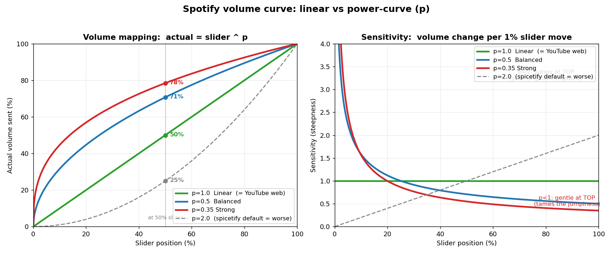

# Spotify Linear Volume

A tiny Windows tray app that gives Spotify a **perceptual, "linear-feeling" volume curve** — without ever touching the Spotify client.

Spotify Desktop's volume slider is top‑heavy: the bottom half barely changes anything and 80–100% is hypersensitive. This tool remaps the slider with a tunable power curve so the whole travel is useful.

It works entirely at the **OS level** through Windows Core Audio (the per‑app session volume you see in the Windows Volume Mixer). It never patches, injects into, or modifies Spotify in any way — so unlike Spicetify‑based tweaks it **survives Spotify auto‑updates and keeps Spotify Lossless intact**.



## How it works

The app maps the on‑screen position `x` (0–1) to an actual gain:

```
gain = x ^ p
```

- `p < 1` — loud, responsive low end, gentle near the top (recommended: **0.35–0.5**)
- `p = 1` — true linear (gain proportional to position)
- `p > 1` — quiet low end, extra‑fine control down low

Spotify's own volume stays at 100%; this tool sets the Windows session volume for the Spotify process, so nothing inside Spotify is modified.

## Features

- **Tunable perceptual curve** with presets (강하게 0.35 → 저음 더 조용 2.0) and a live curve graph.
- **Global hotkeys**: `Ctrl+Alt+↑` / `Ctrl+Alt+↓` to nudge volume from anywhere, with an on‑screen display.
- **Two ways to dock to Spotify** (mutually exclusive):
  - *Overlay* — a slim bar that sits exactly on Spotify's native volume slider, matched to its position and width as the window resizes, and staying clear of the neighbouring buttons. Hover it for an optional roomy **fly‑out slider** when the native rail is too small to drag comfortably.
  - *Compact dock* — a small panel that follows the Spotify window.
- **Settings persistence** (`%APPDATA%\SpotifyLinearVolume\settings.json`) and optional **run‑at‑startup**.
- Single self‑contained `.exe` — no installer, no runtime to chase.

## Requirements

- Windows 10 / 11
- A running Spotify **desktop** app
- To build: [.NET 8 SDK](https://dotnet.microsoft.com/download). To run a self‑contained build: nothing extra.

> Tip: leave Spotify's own volume at 100% and let this tool do the shaping.

## Build & run

```powershell
# from the repo root
dotnet build -c Release
# run the result:
.\bin\Release\net8.0-windows\SpotifyLinearVolume.exe
```

### Single‑file, self‑contained release

```powershell
dotnet publish -c Release -r win-x64 --self-contained ^
  -p:PublishSingleFile=true -p:IncludeNativeLibrariesForSelfExtract=true
```

The standalone `SpotifyLinearVolume.exe` lands under `bin\Release\net8.0-windows\win-x64\publish\`.

## Tech

C# / .NET 8, WinForms (+ WPF for UI Automation), [NAudio](https://github.com/naudio/NAudio) for Core Audio session volume. UI Automation is used only to *locate* Spotify's native slider for the overlay — never to control it.

## Status

Early but usable (`0.1.0`). The volume curve, hotkeys, OSD, overlay and dock modes all work. See [`FEATURES.md`](FEATURES.md) for the backlog and design notes (incl. the hard‑won overlay‑alignment findings).

## License

[MIT](LICENSE).
